This theme supports [Mermaid](https://mermaid.js.org/) diagrams directly in your Markdown content. Mermaid lets you create diagrams and visualizations using text and code.

<!--more-->

## About Mermaid.js

This theme integrates [Mermaid.js](https://mermaid.js.org/) (v11) to render diagrams from text definitions within Markdown code blocks. Mermaid is a JavaScript-based diagramming and charting tool that uses text-based syntax inspired by Markdown.

For complete syntax documentation, see the [Mermaid.js documentation](https://mermaid.js.org/intro/syntax-reference.html).

## Getting Started

To create a Mermaid diagram, simply use a fenced code block with `mermaid` as the language identifier:

````markdown
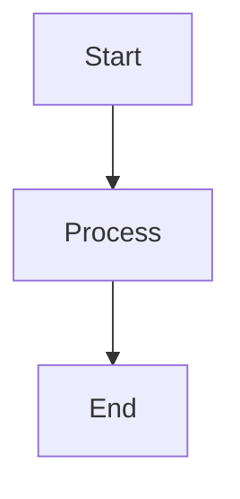
````

The diagram will be automatically rendered when the page loads.

## Features

- **Auto-detection**: Mermaid script only loads on pages that contain diagrams
- **Theme Support**: Diagrams automatically adapt to light/dark mode
- **HTML Labels**: Support for HTML content in labels (like `<br/>` for line breaks)
- **Configurable**: Customize version, security level, and more in your site config

## Configuration

You can configure Mermaid in your site config:

**hugo.yaml:**
```yaml
params:
  article:
    mermaid:
      version: "11"           # Mermaid version from CDN
      look: classic           # classic or handDrawn (sketch style)
      lightTheme: default     # Theme for light mode
      darkTheme: neutral      # Theme for dark mode
      securityLevel: strict   # strict (default), loose, antiscript, sandbox
      htmlLabels: true        # Enable HTML in labels
```

**hugo.toml:**
```toml
[params.article.mermaid]
  version = "11"           # Mermaid version from CDN
  look = "classic"         # classic or handDrawn (sketch style)
  lightTheme = "default"   # Theme for light mode
  darkTheme = "neutral"    # Theme for dark mode
  securityLevel = "strict" # strict (default), loose, antiscript, sandbox
  htmlLabels = true        # Enable HTML in labels
```

### Additional Global Options

These optional settings use Mermaid's defaults when not specified:

**hugo.yaml:**
```yaml
params:
  article:
    mermaid:
      maxTextSize: 50000      # Maximum text size (default: 50000)
      maxEdges: 500           # Maximum edges allowed (default: 500)
      fontSize: 16            # Global font size in pixels (default: 16)
      fontFamily: "arial"     # Global font family
      curve: "basis"          # Line curve: basis, cardinal, linear (default: basis)
      logLevel: 5             # Debug level 0-5, 0=debug, 5=fatal (default: 5)
```

**hugo.toml:**
```toml
[params.article.mermaid]
  maxTextSize = 50000      # Maximum text size (default: 50000)
  maxEdges = 500           # Maximum edges allowed (default: 500)
  fontSize = 16            # Global font size in pixels (default: 16)
  fontFamily = "arial"     # Global font family
  curve = "basis"          # Line curve: basis, cardinal, linear (default: basis)
  logLevel = 5             # Debug level 0-5, 0=debug, 5=fatal (default: 5)
```

For diagram-specific options (like `flowchart.useMaxWidth`), use Mermaid's init directive directly in your diagram:

````markdown
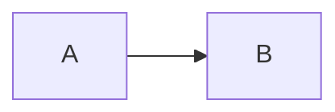
````

> **Security Note:** The default `securityLevel: strict` is recommended. Set to `loose` only if you need HTML labels like `<br/>` in your diagrams.

### Available Themes

| Theme | Description |
|-------|-------------|
| `default` | Standard colorful theme |
| `neutral` | Grayscale, great for printing and dark mode |
| `dark` | Designed for dark backgrounds |
| `forest` | Green color palette |
| `base` | Minimal theme, customizable with themeVariables |
| `null` | Disable theming entirely |

### Custom Theme Variables

For full control, use the `base` theme with custom variables:

**hugo.yaml:**
```yaml
params:
  article:
    mermaid:
      lightTheme: base
      darkTheme: base
      lightThemeVariables:
        primaryColor: "#4a90d9"
        primaryTextColor: "#ffffff"
        lineColor: "#333333"
      darkThemeVariables:
        primaryColor: "#6ab0f3"
        primaryTextColor: "#ffffff"
        lineColor: "#cccccc"
        background: "#1a1a2e"
```

**hugo.toml:**
```toml
[params.article.mermaid]
  lightTheme = "base"
  darkTheme = "base"

  [params.article.mermaid.lightThemeVariables]
    primaryColor = "#4a90d9"
    primaryTextColor = "#ffffff"
    lineColor = "#333333"

  [params.article.mermaid.darkThemeVariables]
    primaryColor = "#6ab0f3"
    primaryTextColor = "#ffffff"
    lineColor = "#cccccc"
    background = "#1a1a2e"
```

Common variables: `primaryColor`, `secondaryColor`, `tertiaryColor`, `primaryTextColor`, `lineColor`, `background`, `fontFamily`

> **Note:** Theme variables only work with the `base` theme and must use hex color values (e.g., `#ff0000`).

## Diagram Types

### Flowchart

Flowcharts are the most common diagram type. Use `graph` or `flowchart` with direction indicators:
- `TD` or `TB`: Top to bottom
- `BT`: Bottom to top
- `LR`: Left to right
- `RL`: Right to left

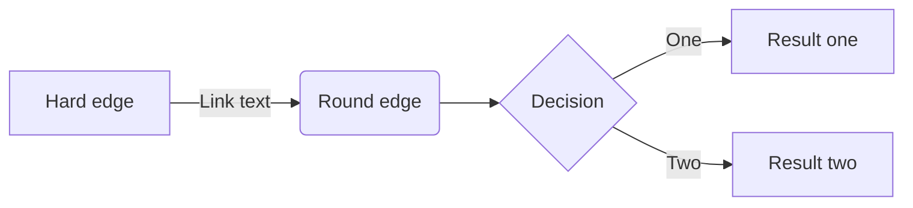

### Sequence Diagram

Perfect for showing interactions between components:

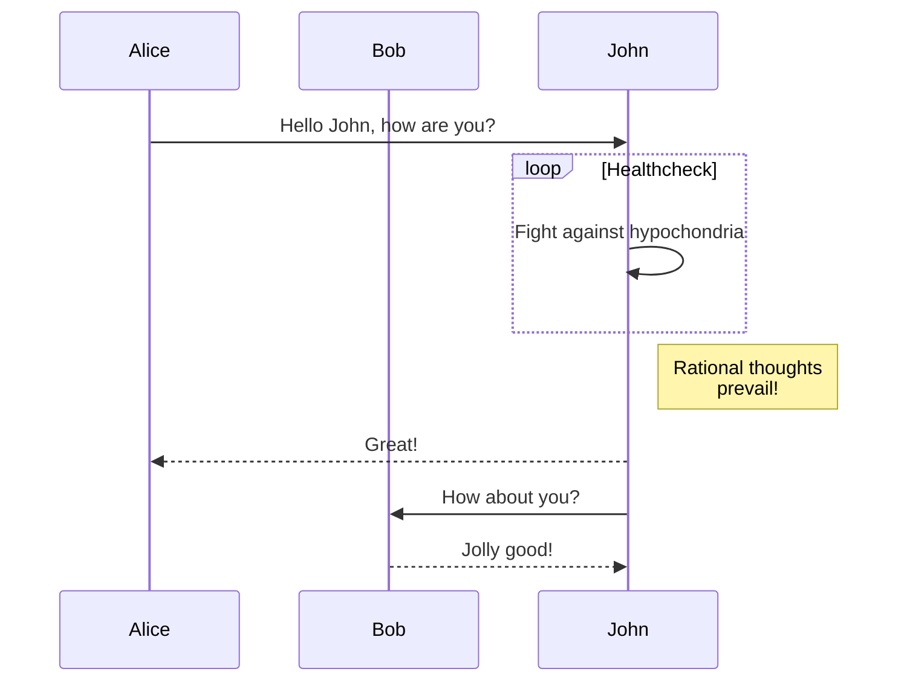

### Class Diagram

Visualize class structures and relationships:

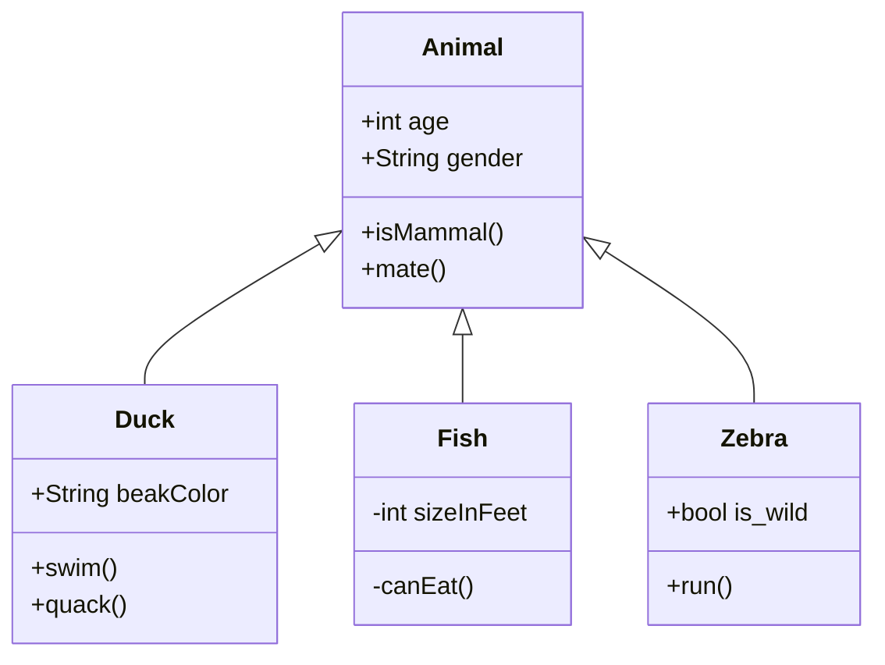

### State Diagram

Model state machines and transitions:

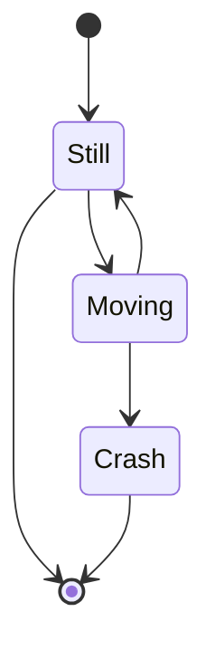

### Entity Relationship Diagram

Document database schemas:

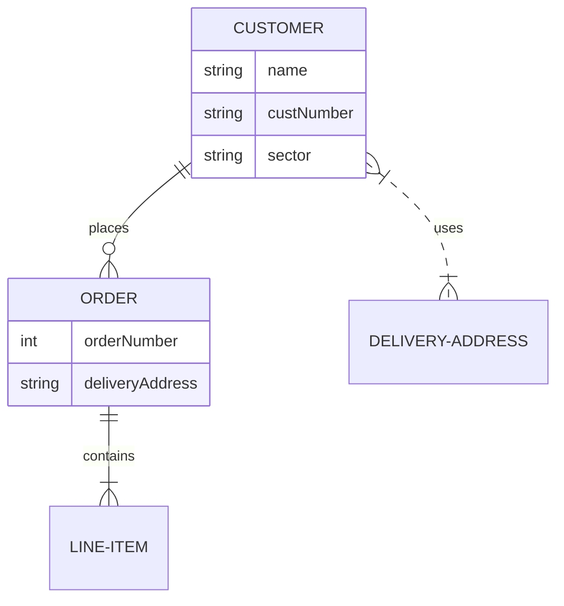

### Gantt Chart

Plan and track project schedules:

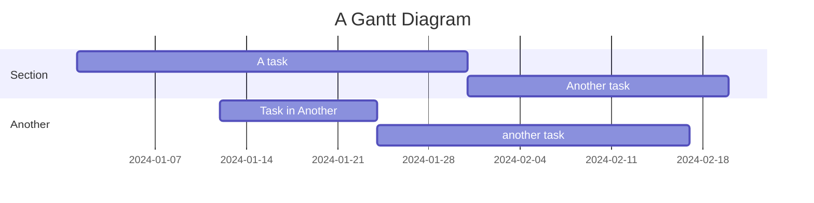

### Pie Chart

Display proportional data:

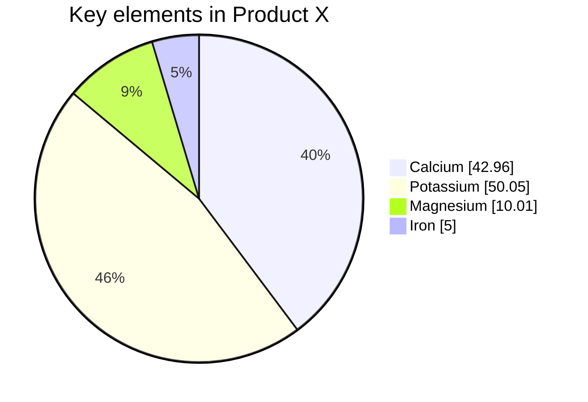

### Git Graph

Visualize Git branching strategies:

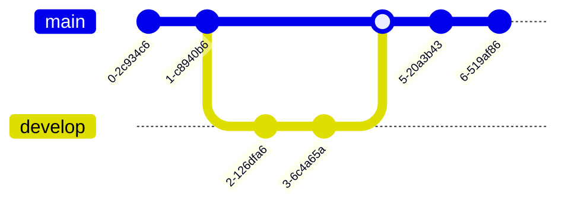

### Mindmap

Create hierarchical mindmaps:

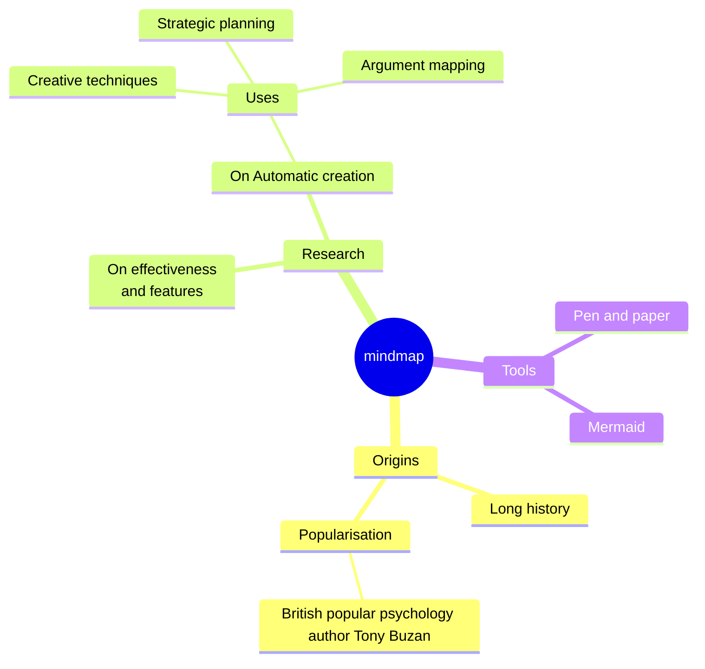

### Timeline

Display chronological events:

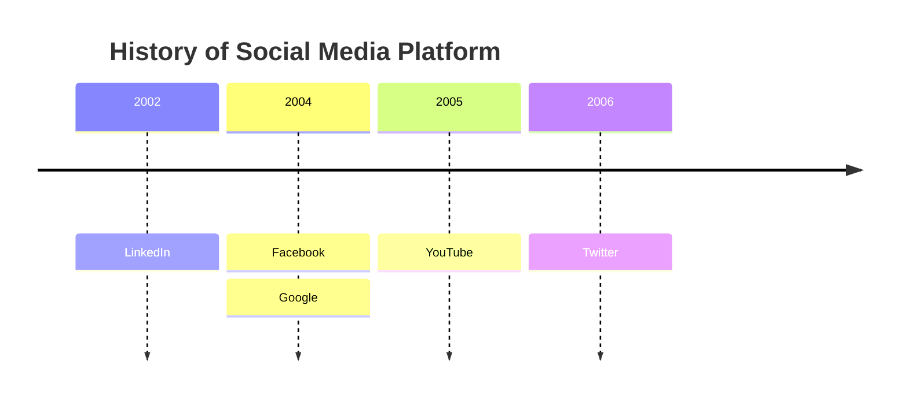

## Advanced Features

### HTML in Labels

To use HTML in labels, you must set `securityLevel: loose` in your site config:

**hugo.yaml:**
```yaml
params:
  article:
    mermaid:
      securityLevel: loose
      htmlLabels: true
```

**hugo.toml:**
```toml
[params.article.mermaid]
  securityLevel = "loose"
  htmlLabels = true
```

Then you can use HTML tags like `<br/>` for line breaks:

````markdown
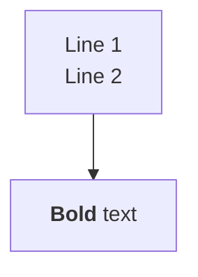
````

### Per-Diagram Theming

Override the theme for a specific diagram using Mermaid's frontmatter:

````markdown
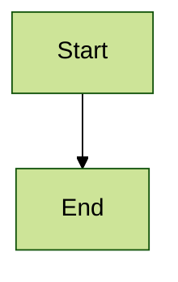
````

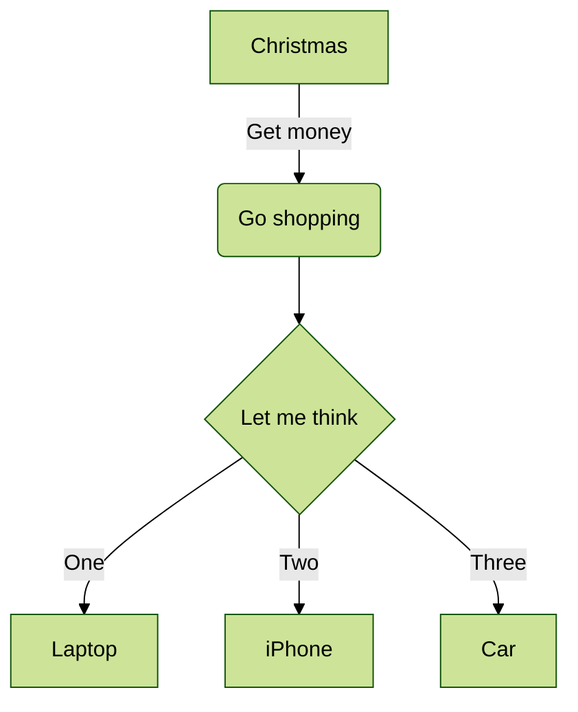

### Inline Styling with `style`

You can style individual nodes directly within your diagram using the `style` directive:

````markdown
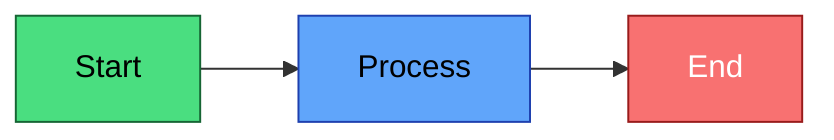
````

**Result:**


Style properties include:
- `fill` - Background color
- `stroke` - Border color
- `stroke-width` - Border thickness
- `color` - Text color
- `stroke-dasharray` - Dashed border (e.g., `5 5`)

### Styling with CSS Classes

You can define reusable styles with `classDef` and apply them using `:::className`:

````markdown
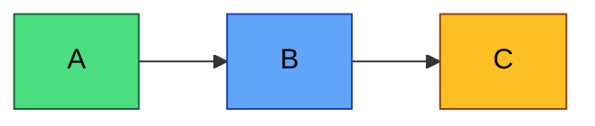
````

**Result:**


### Subgraphs

Group related nodes together:

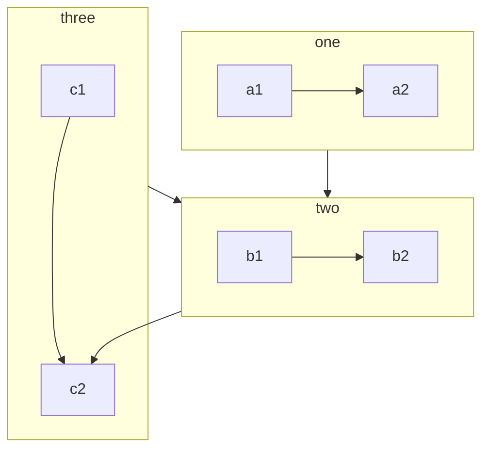

## Theme Switching

This theme automatically detects your site's light/dark mode preference and adjusts the Mermaid diagram theme accordingly:

- **Light mode**: Uses the `default` Mermaid theme
- **Dark mode**: Uses the `dark` Mermaid theme (configurable)

Try toggling the theme switcher to see diagrams update in real-time!

## Complex Example

Here's an example with subgraphs, HTML labels, emojis, and custom styling:

```mermaid
flowchart TD
  subgraph client["👤 Client"]
      A["User Device<br/>192.168.1.10"]
  end

  subgraph cloud["☁️ Cloud Gateway"]
      B["Load Balancer<br/>(SSL Termination)"]
  end

  subgraph server["🖥️ Application Server"]
      C["API Gateway<br/>10.0.0.1"]
      D["Auth Service<br/>10.0.0.2"]
      E["Web Server<br/>10.0.0.3"]
      F["Database<br/>10.0.0.4"]
  end

  A -- "HTTPS Request" --> B
  B -- "Forward<br/>(internal)" --> C
  C -- "Authenticate" --> D
  D -- "Token" --> C
  C -- "Route" --> E
  E --> F

  style client fill:#1a365d,stroke:#2c5282,color:#fff
  style cloud fill:#f6ad55,stroke:#dd6b20,color:#000
  style server fill:#276749,stroke:#22543d,color:#fff
```

> **Note:** This example requires `securityLevel: loose` for HTML labels and styling to work.

## Known Limitations

### Dark Mode Theming

Mermaid.js's built-in themes have some limitations:

- **`dark` theme** (default): Best text contrast, but some diagram backgrounds may appear brownish (e.g., Gantt charts)
- **`neutral` theme**: Better background colors, but some text (labels, legends) may have reduced contrast

**For full control**, use the `base` theme with custom variables:

**hugo.yaml:**
```yaml
params:
  article:
    mermaid:
      darkTheme: base
      darkThemeVariables:
        primaryColor: "#1f2937"
        primaryTextColor: "#ffffff"
        lineColor: "#9ca3af"
        textColor: "#e5e7eb"
```

**hugo.toml:**
```toml
[params.article.mermaid]
  darkTheme = "base"

  [params.article.mermaid.darkThemeVariables]
    primaryColor = "#1f2937"
    primaryTextColor = "#ffffff"
    lineColor = "#9ca3af"
    textColor = "#e5e7eb"
```

We plan to improve dark mode theming in future updates as Mermaid.js evolves.

## Troubleshooting

### Diagram not rendering?

1. Make sure you're using a fenced code block with `mermaid` as the language
2. Check your browser's console for syntax errors
3. Verify your Mermaid syntax at [Mermaid Live Editor](https://mermaid.live/)

### HTML not working in labels?

HTML in labels requires `securityLevel: loose`. Update your configuration:

**hugo.yaml:**
```yaml
params:
  article:
    mermaid:
      securityLevel: loose
      htmlLabels: true
```

**hugo.toml:**
```toml
[params.article.mermaid]
  securityLevel = "loose"
  htmlLabels = true
```

> **Warning:** Using `loose` security level allows HTML in diagrams. Only use this if you trust your diagram content.

### Syntax errors?

Mermaid is strict about syntax. Common issues:
- Missing spaces around arrows
- Unclosed brackets or quotes
- Invalid node IDs (avoid special characters)

## Resources

- [Mermaid Documentation](https://mermaid.js.org/intro/)
- [Mermaid Live Editor](https://mermaid.live/) - Test diagrams interactively
- [Mermaid Syntax Reference](https://mermaid.js.org/intro/syntax-reference.html)
