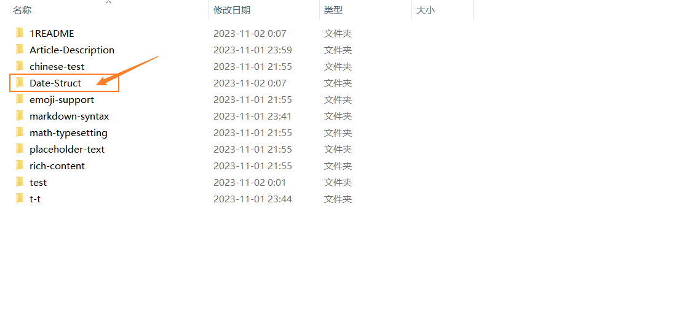

这个文件加中放文章，每篇文章都要放入到一个文件加中。

下面我们来一个例子：

比如说：我们想写一篇名为数据结构的文章：

我可以创建一个文件夹：Date-Struct（这个名字随便起，只要是英文的就好，然后没有固定格式，中间那个-可以加也可以不加）



然后，我们进入Date-Struct文件加创建两个文件index.md与index.zh-cn.md


下面我来写一个示例：

```
+++
author = "文章作者"
title = "文章标题"
date = "文章日期"
description = "对文章的简单描述."
tags = [
	"底部标签",
]
categories = [
    "文章分类",
]
+++

This article offers a sample of basic Markdown.
<!--more-->

# 正文开始
```