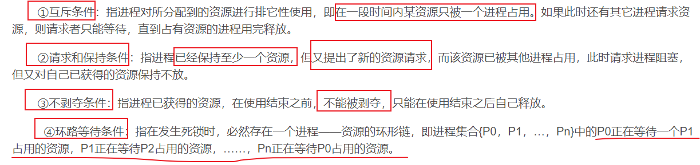
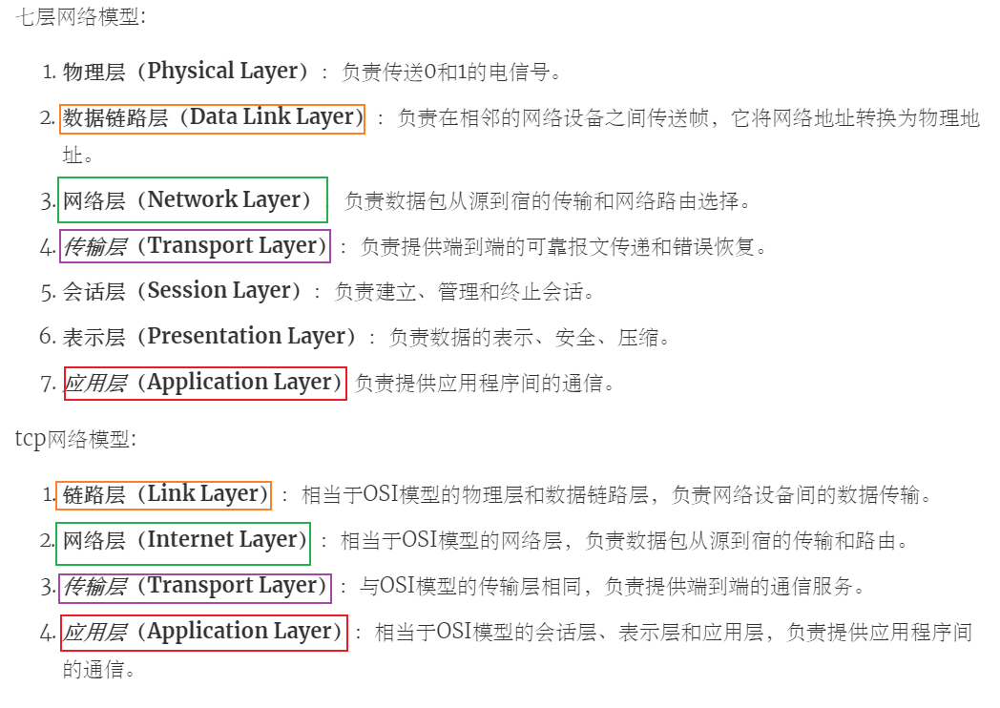

+++
author = "Wxn"
title = "2024-04-19面试复盘"
date = "2024-04-19"
description = "Please read me first."
tags = [
	"Dilay",
]
categories = [
    "面试复盘",
]

+++

This article offers a sample of basic Markdown.
<!--more-->

# 正文开始

在线编程工具:   

https://www.bejson.com/runcode/c740/


sizeof(空类) = 1;

静态成员变量和成员函数都不占类的大小(sizeof),也就是说静态成员变量和成员函数都不属于类


```
继承下面说了

封装:将变量设置为protected或者provate,限制这些变量在类外的直接访问,我们可以使用get常量函数来完成对这个变量的封装

protected:当一个成员被定义为protected类型时，仅能在类内、友元和派类访问。

private:当一个成员被定义为private类型时，仅能在类内、友元访问。

多态下面说了
```


## 1.struct和class的区别

首先,class是cpp独有的,c语言里面没有,

然后就是在cpp中,class的默认访问权限是private,而struct是public;

还有就是class默认都是私有继承,而sruct默认是公有继承.

最后一点是,在语法上的区别,你使用cpp中 ,

不管是struct还是class,都可以直接使用类名.

在c语言中,要么写 struct A  a;(带上struct),要么你用typedef struct A A;一下


涉及知识:https://blog.csdn.net/weixin_52668597/article/details/136666085?spm=1001.2014.3001.5501


补充:公有继承,保护继承与私有继承下,类内的元素的权限变化:

- 公有继承:原来啥权限就还是啥权限,一点不变
- 保护继承:原来公有变保护,其他两个->原来啥权限就还是啥权限
- 私有继承:原来公有变私有,原来保护变私有,原来私有还是私有

## 2.值传递，地址传递，引用传递（拷贝）的区别

值传递你无法在函数中改变这个变量的值

地址传递和引用你可以在函数中改变这个变量的值

值传递相当于是你建立了一个副本,你是你,他是他,你的改变无法影响到他,他的改变无法影响到你.

地址传递的话,传进去的就是本人了,此时修改地址上的数据会影响到原始数据.

而引用传递相当于是给该变量取的别名,相当于是一个大名一个小名比如鲁迅和周树人,本质上还是一个人,所以改变引用传递的变量也可以改变变量的原始数据

## 4.指针是几个字节？

64位系统是8字节

32位系统是4字节

## 5.static关键字

static的用法分为静态变量与静态函数

静态变量将变量限定在当前文件下,且生命周期和该文件运行的周期一样长.

然后再细分就是局部静态变量与全局静态变量:局部静态变量被限定在一个代码块内(一般是一个函数),而全局静态变量只要是在这个文件内,都可以访问.


再者就是静态函数了,<font color=red>静态成员函数只能访问静态成员变量</font>


然后就是,类中的静态成员变量并不属于这个类,你用sizeof去算,他不算这个类的大小


涉及知识:cpp编译单元 https://blog.csdn.net/weixin_52668597/article/details/137575061?spm=1001.2014.3001.5501

## 6.虚函数指针，虚函数表

涉及知识:https://blog.csdn.net/weixin_52668597/article/details/137447982?spm=1001.2014.3001.5501

只要你在类中写了一个虚函数,那么就会产生一个虚函数表.

而且不管你写多少个虚函数,这些虚函数在类中所占的内存就只有8个字节,而占的这八个字节就是虚函数指针,也就是说,这些虚函数都放在一个数组中,这个数组就是虚函数表

## 7.多态

涉及知识:https://blog.csdn.net/weixin_52668597/article/details/137447982?spm=1001.2014.3001.5501


多态其实就是 父类指针指向子类对象,如果子类重写了父类的方法,那么这个父类指针就会呈现出不同的现象

## 8.编译器如何知道你是进行的函数重载

答：函数重载，它允许在同一个作用域中定义多个同名函数，但这些函数的<font color=red>参数列表或类型</font>必须不同。在调用这些函数时，编译器会根据传递给<font color=red>函数的参数的数量、类型或顺序</font>来确定要调用的具体函数版本。

简单来讲，就是函数重载可以是<font color=red>参数类型不同，参数顺序不同，也可以是参数个数不同</font>

编译器会在内部，把函数名称和参数列表一起存储在符号表中，这样编译器就知道了你用的是哪个重载之后的函数

就是，编译器在处理函数重载时，会将函数名称和参数列表一起存储在符号表（或类似符号表的数据结构）中。这样编译器就能够确定每个函数的唯一签名，并且在需要进行函数调用匹配时可以快速检索并确定调用哪个函数版本。


## 9.构造，析构的顺序

在C++中，对象的构造和析构顺序

最主要是

和对象的创建和销毁顺序相关。

一般情况下，<font color=red>对象的构造顺序与对象的创建顺序相同，对象的析构顺序与对象的销毁顺序相反。</font>

比如说，如果一个类 `A` （包含类 `B` 和类 `C` 的对象作为成员），则在创建 `A` 的对象时，首先会调用 `B` 的构造函数，然后调用 `C` 的构造函数。

然后析构顺序就与构造顺序相反。也就说当销毁对象A时，析构函数会按照对象在类成员<font color=red>声明</font>中的逆序依次调用。继续上面的例子，也就是说，他首先会调用 `C` 的析构函数，然后调用 `B` 的析构函数。


还有一种情况：就是父类和子类的析构与构造关系：

比如说现在有一个子类b,他继承了父类a,那么在创建子类b的对象时,

就会先调用父类a的构造函数,

再调用自己子类b的构造函数,

在析构的时候,顺序就反过来了,

就是先析构子类b,

最后再析构父类a

```cpp
Base::fun()
Child::fun()
~Child::fun()
~Base::fun()
```


## 10.stl：vector、list、Map的区别

vector:底层是一个动态数组,可以通过下标进行快速随机访问,占据连续的内存,在不扩容的情况下,在尾部增删很快.在扩容的情况下,需要先开辟原来容器大小的1.5倍,再将原数据拷贝到新的内存,最后在释放原内存

list:是一个双向链表,他访问一个元素的复杂度是o(n),他的内存是不连续的,节点之间通过指针连接.他唯一的优势是可以快速的在任意位置进行增删,但前提是先经过o(n)的复杂度找到这个位置

Map:是一个键值对,类似于json那种结构,底层是红黑树实现.

每个键都是唯一的(键和值可以为null,但是键只能出现一次),

map在插入好删除时会自动排序,他对元素的访问、插入和删除操作，这些操作的时间复杂度通常是对数时间（即`O(log n)`）。


```cpp
#include<iostream>
#include<map>

using namespace std;

class A{};

int main()
{
    map<A*,int> m1,m2;
    m1[nullptr] = 1;
    A *a = new A();
    m2[a] = 2;
    
    printf("%d,%d",m1[nullptr],m2[a]);

    map<A*,A*> m3;
    m3[nullptr] = nullptr;
    return 0;
}


```


## 11.智能指针

智能指针有auto_ptr，share_ptr，unique_ptr还有shared_ptr

auto_ptr是C++98中引入的第一个智能指针，但是由于他的不安全性已被C++11弃用。他其实被unique_ptr给取代了,可以理解为auto_ptr他其实是一个浅拷贝,非常容易造成多个指针指向同一块内存区域的现象，这就引发非常多的潜在的问题:比如一些常见的段错误,多次析构,访问一段未定义的空间等,比如说你在文件中访问这个指针,但是其实你已经在其他地方释放这段内存了.

然后,unique_ptr 他提供了独占所有权的智能指针，允许有且仅有一个 `unique_ptr` 拥有资源。与 `auto_ptr` 不同，`unique_ptr` 实现了更安全和更完整的独占所有权语义

然后,shared_ptr,他允许多个指针共享同一块内存，<font color=red>并且会在最后一个 shared_ptr 被销毁时释放这段内存</font>。它使用的是一种引用计数的技术来追踪资源的所有者数量，并在所有者数量为零时自动释放资源。

然后最后一个,是weak_ptr: 他是 `shared_ptr` 的伴侣类，它允许你共享资源但不拥有资源。weak_ptr 不会增加引用计数,它通常用于解决 `shared_ptr` 的循环引用问题。


循环引用的问题:

然后循环引用通常是shared_ptr互相引用造成的,两个或多个对象相互持有对方的 shared_ptr，导致它们的引用计数永远不会降为零，然后导致资源泄漏。
我想到的一个例子是，比如说有一个双向列表，他们的每个节点对象都有两个指针,一个是前指针prior pointer，一个是next指针，

然后两个相邻的节点对象，节点1的next指针指向节点2自身，节点2的前指针prior pointer指向节点1自身，然后这两个节点都用share_ptr进行创建,在创建时,节点自身这段内存引用计数+1,然后被相邻指针指向时,引用计数再+1,这样每个节点的引用计数就都是2,

然后当我们销毁节点这个share_ptr后,前后节点的引用计数都降为了1,但是前节点在等着后节点的prior pointer放手,后节点在等着前节点的next pointer放手,这就形成了死锁,

造成的现象就是这两个节点的指针已经被销毁了,但是节点的内存迟迟无法析构,就造成了"内存泄漏",解决的办法就是把这个节点的prior指针和next指针都变成weak_ptr


## 12.项目中如何保证线程安全？(如何避免死锁)

加锁:**互斥锁**,**读写锁**,cpp中特有的智能锁

死锁；

- 产生的条件：互斥，请求保存，不可抢占，循环等待

- 可能产生的情况分为两种：

  

  1)第一种是：用到了一把锁造成的死锁，产生的原因是操作失误，加了锁后忘记解锁了
  或者是一把锁被加了两次造成的死锁，你再去解锁就解不开了…
  或者是你在解锁之前，因为满足某种条件提前return了

  ```
  eg：
  void func（）{
      上锁
      if（条件）return;
      解锁
  }
  ```

  

  说是忘记，但有时候就是容易但这样的错误，而且在项目开发的时候调试起来没那么容易，比如说我们最容易犯的函数循环嵌套的死锁问题；函数a调用了函数b，但是函数a和b内部都用到了同一把锁，保护相同的共享资源，导致一个线程同时上两次锁，这个问题还是比较隐晦的，我遇到过一次

  

  

  2)另一种是用到了多把锁，
  当多个线程访问了多块共享资源，就需要多把锁，（共享资源可以是一个全局变量，也可能是一段堆内存，还可能是一个静态资源，或者是在main函数中申请的一段栈空间，因为只要main函数不结束，这个资源就不会被回收，所以也可以做这个共享资源），所以说每个共享资源都需要一把锁。
  比如说两个共享资源两把锁，资源x被锁a锁住了，资源y被锁b锁住了，在资源x没有解锁的情况下，资源x去访问资源y，而资源y也在没有解锁的情况下去访问资源x，这样就僵持不下

- 死锁避免的解决办法：

1. 第一种方法：你在访问其他共享资源时，需要先把你目前持有共享资源解开。
2. 第二种方式：在访问共享资源时，不要直接加锁，而是尝试加锁()，因为我们提供的互斥锁里面都有一个trylock，如果尝试失败，你就先等一等，等其他线程解锁后，你再trylock就成功了
3. 另外，cpp11还提供了lock_guard智能锁，和智能指针管理类似，使用了lock_guard我们就不需要去维护互斥锁的解锁操作。不过，lock_guard管理的是一个大括号这一段代码，假如说这段大括号有100多行代码，使用lock_guard就不太划算，因为锁住的太多了，这个使用还是使用常规锁，不要使用智能锁。

---

在项目中,我使用的是libevent+线程池,在线程池中有很多子线程,如果有子线程操作共享资源,那么需要加锁,

这里也是会有一个生产者消费者的概念,任务队列相当于那个容器,不断有生产者线程给任务队列中放任务,也不断有消费者线程从任务队列里面拿任务,生产者线程不只一个,消费者线程也不只一个.

<font color=red>如果只有一个任务队列,会出现惊群效应</font>:只有一个任务可拿,但是却唤醒了所有的消费者线程,最后只有一人能够拿到这个任务,其他消费者都是无效唤醒

为了解决这个"惊群效应",我们采用建立多个任务队(有多少个线程,就创建多少个任务队列),每个线程都有属于自己的任务队列,那么此时就不再出现线程与线程之间的竞争了(就和libevent+线程池一样,每个线程都有属于自己的事件集合,为的就是避免线程竞争),既然该任务队列被一个线程独占,那么就不存在竞争了,就无需加锁,他在添加的时候不能处理,他在处理的时候不能添加

主线程负责两件事:

1)负责和新客户端建立连接

2)主线程还会给任务队列中添加任务,子线程负责从任务队列中取任务


---

有一个很傻的问题:

问任务队列加了互斥锁,其他线程想访问时会被阻塞,你还是如何唤醒他们的?

> 答:这个其实不用唤醒,我们在使用互斥锁保护一段共享资源时,
>
> 访问前上锁,访问后解锁,
>
> 当我们某一个线程正在访问这个共享资源时上锁保护,其他的线程就会被排斥在外,
>
> 然后这些线程就会不断地尝试加锁,
>
> 当正在操作共享资源的这个线程解锁后,哪个线程先抢到,哪个线程就使用共享资源,
>
> 是不需要唤醒的.

- 总结一下,如何唤醒阻塞?

1)如果是互斥锁导致的阻塞,阻塞的时候就使用lock加锁,要唤醒的时候使用ulock解锁就行了.

2)如果是条件变量导致的阻塞,那么当你要阻塞的时候就是wait函数,如果你要唤醒一个那就是notify_one,如果要唤醒全部那就是notify_all


再补充一点:读写事件

读事件是如果 读缓冲区 有数据可读,读事件自动就触发了

写事件是 **在写之前**,检查 写缓冲区 是否可写,如果可写写事件才会被处罚.   并不是写入之后才会被触发.


## 13.死锁

死锁产生的条件:



## 14.多线程中多个信号与主线程

主线程一般是负责控制和协调其他线程的任务。比如说我这个共享单车项目中的服务器,他的主线程主要是负责监听客户端的连接,一旦有客户端来进行连接,我们就会把这个客户端通过libevent变成一个事件,并把他加入到事件集合中去,然后由其他线程来监听该客户端的读写事件,并通过轮询的方式拿到线程池中的一个线程,然后由这个线程通过调用它自己的回调函数来处理这个读写事件.相当于主线程就是是负责统筹规划的,他只复制监听客户端,剩下的交给其他线程.

然后我的毕设的服务器是只用到了libevent,没有用到线程池,毕设主要的项目亮点是硬件的uboot系统移植以及arm架构下的库的交叉编译,还有qt的自定义部件、界面以及qt打包等,最终形成一个完善的项目.

然后硬件是用到的一个多进程通信，使用的是shm共享内存


 在多线程编程中，主线程可以通过发送信号来与其他线程进行通信。

常见模式有：

1). **条件变量（Condition Variables）**：相当于是一种基于互斥锁的线程间同步机制，通常情况下是和锁一起使用的。主线程可以使用条件变量来等待特定的条件达成，而其他线程则可以通过发送信号来通知主线程条件的改变。一旦条件满足，主线程就会被唤醒并继续执行。

2). **事件（Events）**：事件也是一种用于线程间同步的通信机制，通常用于向其他线程发出信号以触发特定事件的发生，然后执行事件的回调函数。主线程可以等待某个事件的发生，其他线程可以通过发送信号来触发该事件。

3). **信号量（Semaphores）**：

   信号量维护一个计数器，表示可用资源的数量。线程可以通过请求（等待）和释放（发信号）操作来获取和释放资源。当计数器为正时，线程可以继续执行，否则线程会被阻塞直到资源可用。就是我们常说的那个操作系统pv操作，经常用来解决“生产者消费者的问题”,当然信号量也是可以的

   伪代码：

```cpp
生产者和消费者都可以有很多个

情况有三种:
1.队列已满,生产者停止生产商品  -> 生产者wait条件变量
2.队列为空,消费者无商品可取  -> 消费者wait条件变量
3.队列不满但非空,生产者正常生产商品,消费者正常取商品

#include "需要的头文件"

//wait()-> P()操作 --
//signal()-> V()操作  ++

typedef struct{
    int value; //剩余资源数
    struct process *list;//等待队列
} semaphore;

semaphore empty,full;//空位和产品的数量  空位数+产品数=最大容量
Mutex mutex1,mutex2;//两个互斥锁

//申请使用资源
void wait(semaphore s)
{
    s.value --;
    if(s.value < 0)//剪完1后,可能等于0(表示资源刚好用完,但是够用,所以不阻塞),也可能<0(资源早就用完了,再减一就没得用了,所以要阻塞)
    {
        block(s.list);
    }
}

//使用完释放资源
void signal(semaphore s)
{
    s.value ++;
    if(s.value <= 0)//刚释放完一个资源(也就是说现在有一个资源可用),发现资源数==0,说明说明之前是<0的,表示队列已经阻塞了;如果发现资源数<0,那就更不用说了,肯定有消费者在等待
    {
        wakeup(s.list);
    }
}


// 生产者函数
void producer() {
    while (1) {
        produce();//生产1个东西
        wait(empty);//空位减1个
        wait(mutex1);//上锁

        array[空位] = 产品;//给一个空位放产品

        signal(mutex1);//解锁
        signal(full);//产品数+1

    }
}

// 消费者函数
void consumer() {
    while (1) {
        wait(full);//产品数-1
        wait(mutex2);//上锁

        array[产品数] = null;//拿走一个产品

        signal(mutex2);//解锁
        signal(empty);//空位+1

        comsum();//消费这个产品
    }
}

int main() {
    std::thread prod(producer);
    std::thread cons(consumer);
    prod.join();
    cons.join();
    return 0;
}


```

```
信号量（Semaphore）：
信号量是一种用于控制对共享资源的访问的同步机制。它通常用于实现进程或线程间的协调。信号量主要包含两种操作：wait()（或称为P()操作）和 signal()（或称为V()操作）。wait()操作会减少信号量的计数，如果结果为负数，则线程会阻塞。signal()操作会增加信号量的计数，如果有线程正在阻塞，它会被唤醒。
```


4). **消息队列（Message Queues）**：主线程可以通过发送消息到队列中来通知其他线程，而其他线程则可以从队列中接收消息并执行相应的操作。


15.qt信号槽中有第五个参数，有了解过吗？

信号槽中有第五个参数支持qt中,信号与槽进行跨跨线程通信,他是一个枚举值,
默认是自动连接,也比较智能,如果信号与槽是在同一个线程,就直接调用槽函数,如果不在同一个线程,会自动使用QueuedConnection.

然后支持多线程的枚举值其实有两个,一个是Queued Connection,另一个是BlockingQueuedConnection,这两个支持信号与槽的异步通信,唯一的区别是:

Queued Connection是异步非阻塞的，BlockingQueuedConnection是异步阻塞的,然后非阻塞是运行后直接返回,阻塞是运行结束后才返回.
Queued Connection用的比较多,他可以保证槽函数的调用是在接收者的线程中进行的，所以就不会有多个线程同时访问槽函数中的共享资源的情况发生（除非槽函数内部又进行了不安全的跨线程操作）,这样就避免线程竞争,避免了线程安全的问题。


# 补充:

## 1)C语言链表

```c
#include <stdio.h>
#include <stdlib.h>

typedef struct Node{
    int data;
    struct Node * prior;
    struct Node * next;
} Node;


int main ()
{
    /***
     * c语言像数组的链表
    */
   /*
    Node* list = (Node *)malloc(sizeof(Node) *5);


    if (list == NULL) {
        // 内存分配失败的处理
        fprintf(stderr, "Memory allocation failed.\n");
        return 1;
    }
    
    // 初始化链表节点
    for (int i = 0; i < 5; ++i) {
        list[i].data = i; // 数据域初始化为索引值或其他你选择的值
        
        if (i == 0) {
            // 第一个节点的前驱指向 NULL
            list[i].prior = NULL;
        } else {
            // 其他节点的前驱指向前一个节点
            list[i].prior = &list[i - 1];
        }
        
        if (i == 4) {
            // 最后一个节点的后继指向 NULL
            list[i].next = NULL;
        } else {
            // 其他节点的后继指向下一个节点
            list[i].next = &list[i + 1];
        }
    }
    
    // ... 使用链表
    for(int i = 0; i< 5;i++)
    {
        int num = list[i].data;
        printf("%d\n",num);
    }
    // 释放分配的内存
    free(list);
    */

   /******c语言链表********/
    Node *n1 = (Node *)malloc(sizeof(Node));
    Node *n2 = (Node *)malloc(sizeof(Node));
    Node *n3 = (Node *)malloc(sizeof(Node));
    n1->data = 1;
    n1->prior = NULL;
    n1->next = n2;

    n2->data = 2;
    n2->prior = n1;
    n2->next = n3;

    n3->data = 3;
    n3->prior = n2;
    n3->next = NULL;

    for(Node * node = n1; node != NULL;node = node->next)
    {
        int num = node->data;
        printf("[%d]\n",num);
    }
    
    return 0;
}

输出:
[1]
[2]
[3]
```

## 2)链表-智能指针版

```cpp


#include <iostream>
#include <memory>//智能指针

using namespace std;

struct Node{
    int data;
    weak_ptr<Node> prior;
    weak_ptr<Node> next;
};


int main()
{
    shared_ptr<Node> n1 = make_shared<Node>();
    shared_ptr<Node> n2 = make_shared<Node>();
    shared_ptr<Node> n3 = make_shared<Node>();
    n1->data = 1;
    n1->prior.reset();//智能指针设置为空应该用reset函数,而不是n1->prior = nullptr;
    n1->next = n2;

    n2->data = 2;
    n2->prior = n1;
    n2->next = n3;

    n3->data = 3;
    n3->prior = n2;
    n3->next.reset();//n3->next = nullptr;

    for(shared_ptr<Node> node = n1 ; node != nullptr ; node = node -> next.lock()){//你需要先用lock将weak_ptr提升为shared_ptr才能够进行赋值
        int num = node ->data;
        printf("[%d]\n",num);
    }


    //销毁智能指针(你也可以不销毁,因为智能指针自己非常懂事)
    n1.reset();
    n2.reset();
    n3.reset();

    return 0;
}
输出:
[1]
[2]
[3]
```

## 3)链表-普通cpp版

```cpp


#include <iostream>

using namespace std;

struct Node{
    int data;
    Node* prior;
    Node* next;
};


int main()
{
    Node * n1 = new Node;
    Node * n2 = new Node;
    Node * n3 = new Node;
    n1->data = 1;
    n1->prior = nullptr;
    n1->next = n2;

    n2->data = 2;
    n2->prior = n1;
    n2->next = n3;

    n3->data = 3;
    n3->prior = n2;
    n3->next = nullptr;

    for(Node * node = n1 ; node != nullptr ; node = node->next){
        int num = node ->data;
        printf("[%d]\n",num);
    }


    //销毁智能指针
    delete n1;
    delete n2;
    delete n3;

    return 0;
}
输出:
[1]
[2]
[3]
```

## 15. 面试补充

1)网络的状态码:

以5开头的一般表示的服务器状态的异常

302:本次请求成功了,你还需要继续请求

好,为什么还需要继续请求?资源可能由于维护、更新或其他原因临时移动到了新的位置,你请求的资源现在临时存在于另外一个地址，请去那里请求。

2)cpu调度算法

1. **先来先服务**：这是最简单的调度算法。<font color=red>按照请求CPU的顺序进行调度</font>。一个进程完全执行完后，下一个进程才开始执行。其主要缺点是“饥饿”（某些进程可能需要等待很长时间）和“凸轮”现象（较短的任务可能要等待一个长任务执行完毕）。
2. **短作业优先（SJF，Shortest Job First）**：<font color=red>这个算法选择预计运行时间最短的进程并先执行它</font>。虽然这可以减少平均等待时间，但实际上很难知道进程的预计运行时间，而且长作业可能遭到饥饿。
3. **最短剩余时间优先（SRTF，Shortest Remaining Time First）**：<font color=red>这是SJF(短作业优先)的抢占式版本，如果新到的进程的预计剩余运行时间比当前正在运行的进程的剩余时间短，CPU将被分配给新进程</font>。这种方法也面临着长作业饥饿的问题。
4. **轮转调度（RR，Round Robin）**：这是最常用的抢占式调度算法。<font color=red>它将时间分为固定长度的片段，按顺序将CPU分配给进程</font>。如果一个进程在其时间片结束时还没有完成，它将被放回就绪队列的末尾。这种方法提高了响应时间，但如果时间片设置得不合理，可能导致CPU效率低下。<font color=red>比如说只给你10分钟享受这个资源,10分钟你还没办完,你就先下去,重新排队,让后面的进程来</font>
5. **优先级调度**：在这个算法中，<font color=red>每个进程都被分配一个优先级。具有最高优先级的进程将首先获得CPU，相同优先级的进程可以采用FCFS或RR等其他调度算法进行调度</font>。问题在于低优先级进程可能会遭受无限期的饥饿。
6. **多级反馈队列（MFQ，Multilevel Feedback Queue）**：<font color=red>(太难了,不要背这个)</font>,这是一种复杂的调度算法，旨在克服上述算法的缺点。在这种方法中，进程根据其属性（如CPU使用时间、进程优先级）被分配到不同的队列，并在这些队列之间根据其行为（如执行时间、等待时间）动态移动。这种方法试图平衡响应时间和CPU利用率。

3)

1.虚拟内存是一个什么样的概念?当物理内存消耗殆尽时,我们还想拥有更多的内存,这个时候系统只能从其他地方给你找点空间来进行临时的替代,<font color=red>而硬盘就是这个临时空间</font>.

比如你运行一下3A大型游戏,你电脑的运存不够大,这个时候就需要开辟一段虚拟内存来支持这个程序的运行

2.虚拟内存从哪里来的?

物理内存有内存条,虚拟内存:硬盘来的

4)数据库的事务有哪些?

事务是指一系列操作的集合,要么都成功,要么都失败.

比如去购物,消费者扣钱是一个操作,超市账户加入等量的钱是第二个操作.这两个操作,你要么都成功,要么都失败,你不可以出现"消费者扣了钱,但是超市账户那里没收到钱"这样的现象.

所以我们可以开启一个事务(start transaction[船然可胜];)将这两个步骤加入到一个事务中,要么都成功要么都失败.

我们还可以在这个事务中保存一些节点,来方便我们回滚到某些节点,最后确保都成功后,我们在commit进行提交.

5)七层网络模型和tcp网络模型你能说出来嘛?

1. 

6)git在版本管理中的分区是怎样的呢?

工作区(你在电脑上进行的一些增删改)、暂存区(git add)、本地仓库(git commit)和远程仓库(git push)

7)应用程序占用哪些端口咋么看?

回答了netstat | grep 8000,其实完整的话是:

netstat -tlnp | grep 8000