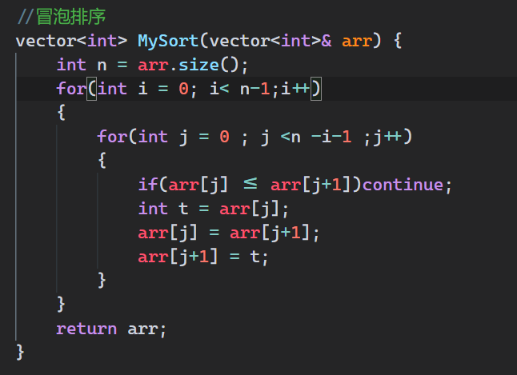

+++
author = "Wxn"
title = "2024-04-20七大排序算法"
date = "2024-04-20"
description = "Please read me first."
tags = [
	"Dilay",
]
categories = [
    "面试复盘",
]

+++

This article offers a sample of basic Markdown.
<!--more-->

# 正文开始

https://www.nowcoder.com/login?callBack=%2Fprofile%2F319706329%2FcodeBookDetail%3FsubmissionId%3D416948138

## 冒泡排序(从小到大)
```cpp
#include <iostream>
#include <vector>

using namespace std;

//冒泡排序
vector<int> MySort(vector<int>& arr) {
    int n = arr.size();
    for(int i = 0; i< n-1;i++)
    {
        for(int j = 0 ; j <n -i-1 ;j++)
        {
            if(arr[j] <= arr[j+1])continue;
            int t = arr[j];
            arr[j] = arr[j+1];
            arr[j+1] = t;
        }
    }
    return arr;
}

int main()
{
    vector<int> arr{5,2,3,1,4};
    for(auto it : arr)
    {
        cout<<it<<" ";
    }
    cout<<" "<<endl;
    MySort(arr);
    for(auto it : arr)
    {
        cout<<it<<" ";
    }
    return 0;
}

```


