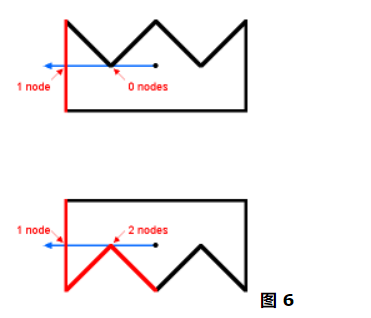
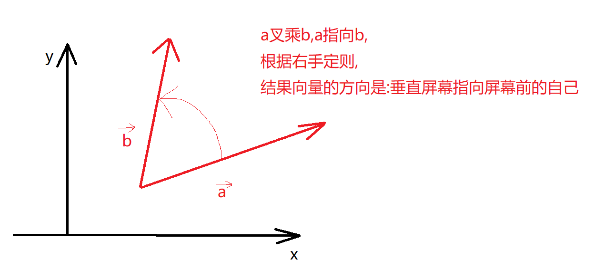
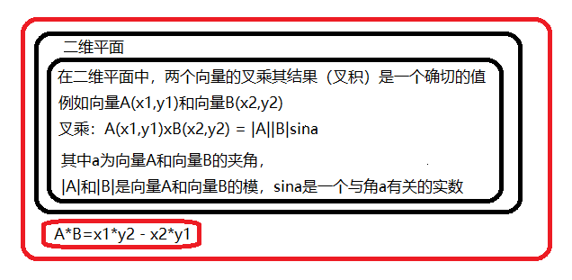
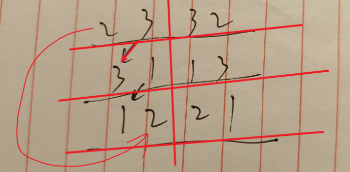
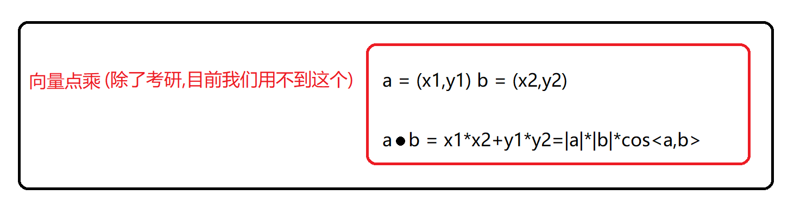
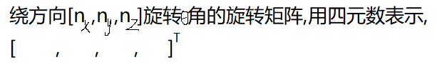

+++
author = "Wxn"
title = "三维方向的思考"
date = "2023-11-05"
description = "Please read me first."
tags = [
	"三维方向的思考",
]
categories = [
    "个人随笔",
]

+++

This article offers a sample of basic Markdown.
<!--more-->

# 正文开始

## OpenGL

着色器与纹理贴图

## 一道题

如何判断一个点(x,y)在一个多边形的内部,外部,还是边上?

我们先来看看国外教授的看法:https://alienryderflex.com/polygon/



这种情况有点特殊,而且如果遇到了也不知道如何解决.所以我找找看有没有更简单的办法

----

下面这个同学讲的很好,使用叉乘!

博客:【如何判断点在多边形内部 - CSDN App】http://t.csdnimg.cn/JMdc7

视频:[教学视频](https://www.bilibili.com/video/BV1FD4y1i7Dy/?share_source=copy_web&vd_source=9a022d27a757e495adc6e15743c4ec1d)

<font color=red>下面来讲一下叉乘</font>:这个很重要:<font color=orange>右手定则,叉乘结果的方向,叉乘a与b的先后顺序</font>



### 叉乘:



a（x1，y1），b（x2，y2），则a×b=（x1\*y2-x2\*y1）

---


```
顶点一:(0,0,0)
顶点二:(1,0,0)
顶点三:(0,1,0)
向量a = (1,0,0)-(0,0,0) = (1,0,0) = (a₁,a₂,a₃)
向量b = (0,1,0)-(0,0,0) = (0,1,0) = (b₁,b₂,b₃)
axb = (0,0,1)

```

至于为啥 (1,0,0)  $X$  (0,1,0) = (0,0,1)?

根据叉积的计算公式为：==23 32, 31 13,12 21==
$a × b$ = ($a₂b₃$- $a₃b₂$, $a₃b₁$ - $a₁b₃$, $a₁b₂$ - $a₂b₁$)

=(0\*0-0\*1, 0\*0-1\*0, 1\*1-0\*0)

=(0, 0 ,1)



### 点乘:(完整)



上面是二维,下面是三维:

 V1( x1, y1, z1)·V2(x2, y2, z2) = x1\*x2 + y1\*y2 + z1\*z2


## 继续这道题

## 四元数又是什么?

