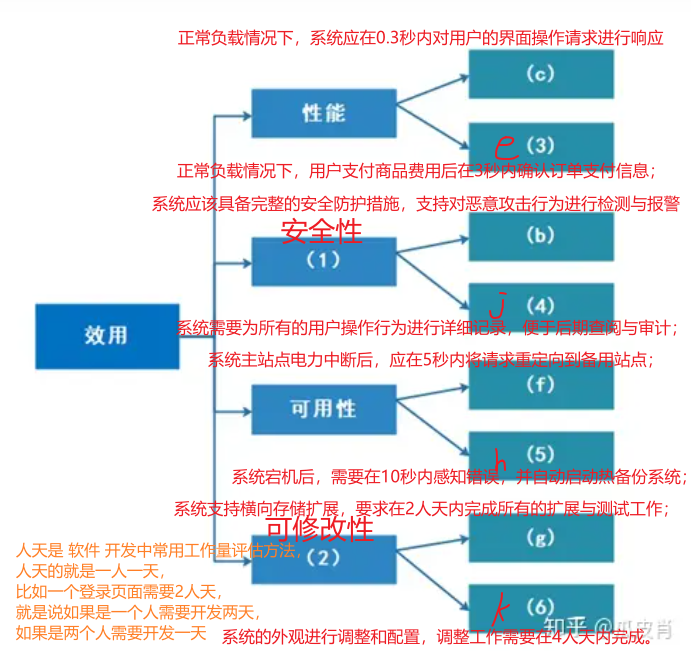

+++
author = "Wxn"
title = "实习-2023-11-03"
date = "2023-11-03"
description = "Please read me first."
tags = [
	"Dilay",
]
categories = [
    "实习日记",
]

+++

This article offers a sample of basic Markdown.
<!--more-->

# 正文开始

[（九）软件架构设计 - 瓜皮肖的文章 - 知乎](
https://zhuanlan.zhihu.com/p/603201577)

今天又是学习当架构师的一天，暂时没什么好说的，先这样，后续慢慢补充。

软考网站:

https://www.ruankao.org.cn/index/zgsz

