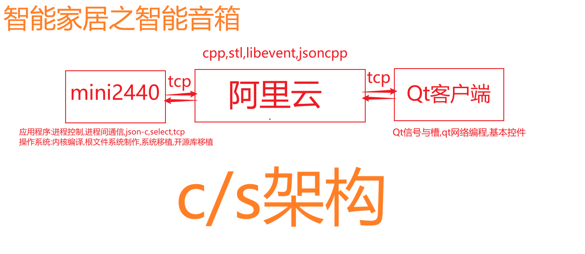

+++
author = "Wxn"
title = "毕业设计"
date = "2023-11-04"
description = "Please read me first."
tags = [
	"毕业设计进度",
]
categories = [
    "毕业设计",
]

+++

This article offers a sample of basic Markdown.
<!--more-->

# 正文开始

# 个人介绍

本人本科专业为物联网工程,拥有4年的c/cpp开发经验,虽然大多时候都在摆烂...

本人熟悉软件硬件的相关知识,不仅在学校内广泛涉猎专业知识,还参加过大多数的培训机构的培训,A9单板,mini2440,树莓派linux开发.

项目有:WebSever(用于欢乐斗地主的服务端,客户端还未完成),共享单车(linux+qt for Android),仿真QQ(客户端+服务端都用Qt),淘宝分布式文件系统(linuxC编程、mmap、哈希桶)，车库管理系统（树莓派+C+OpenCV+qt），上位机实时监控系统（Qt serialport串口编程）...

# 项目架构

# 项目开工

## ARM端

## 服务器端

## 客户端

