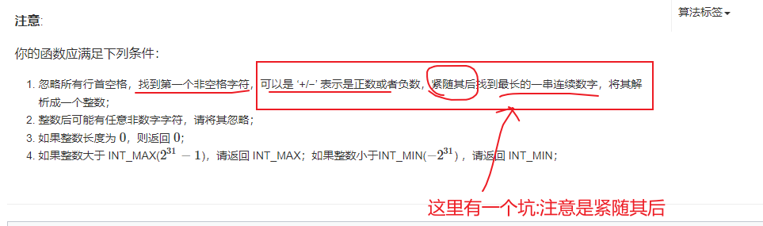
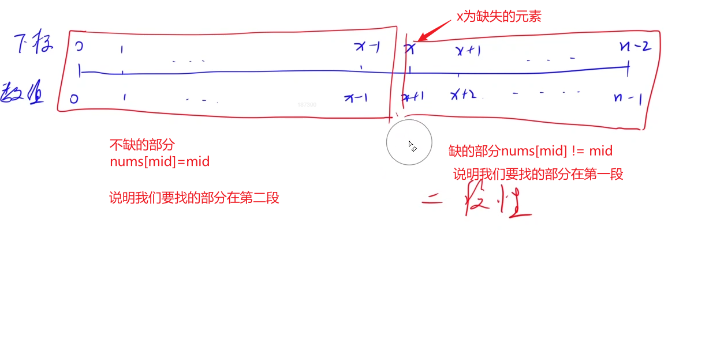
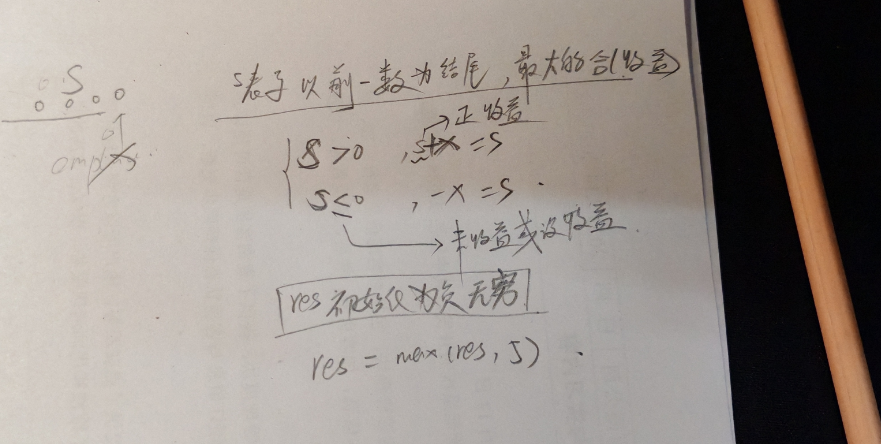
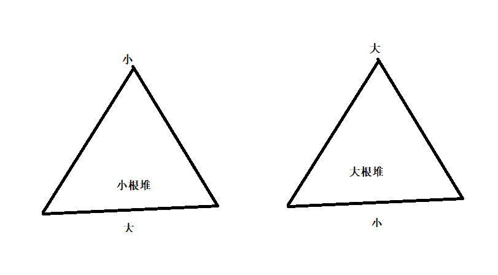
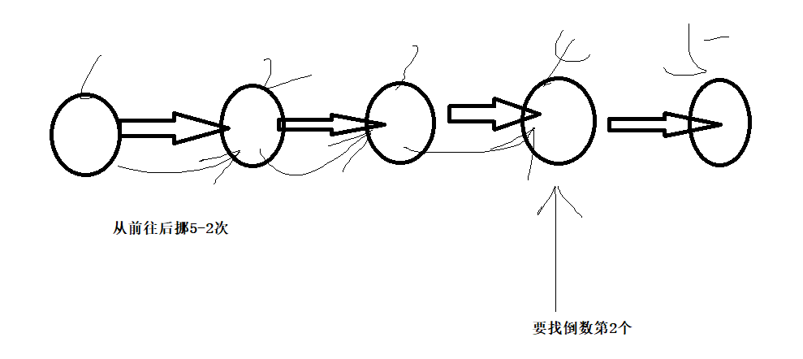
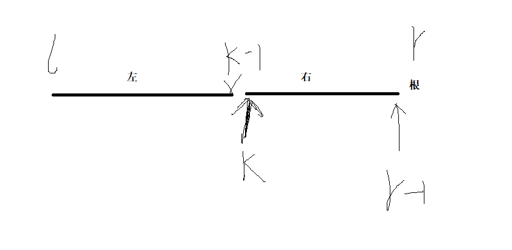

+++
author = "Wxn"
title = "给个offer"
date = "2024-04-24"
description = "Please read me first."
tags = [
	"Dilay",
]
categories = [
    "面试复盘",
]

+++

This article offers a sample of basic Markdown.
<!--more-->

# 正文开始

如果考到数论的题,会做你就做,不会做你就说你对数论这块不太熟悉,数论这个面算法工程师考的比较多,做开发的话链表比较多

## 1.41. 包含min函数的栈

```cpp
//https://leetcode.cn/problems/bao-han-minhan-shu-de-zhan-lcof/description/
class MinStack {
public:
    /** initialize your data structure here. */
    //1.单调栈
    //2.主栈与辅助栈
    //3.1)push都要插入（如果辅助栈为空，或者辅助栈顶>=x，则辅助栈插入）
    //2)pop() 如果辅助栈顶 == 主栈顶，则辅助栈顶弹出，否者就只有主栈弹出
    //3)4)直接返回相应的栈
    MinStack() {
        
    }
    
    void push(int x) {
        
    }
    
    void pop() {
        
    }
    
    int top() {
        
    }
    
    int getMin() {
        
    }
};

/**
 * Your MinStack object will be instantiated and called as such:
 * MinStack obj = new MinStack();
 * obj.push(x);
 * obj.pop();
 * int param_3 = obj.top();
 * int param_4 = obj.getMin();
 */
```


## 2.35. 反转链表

```cpp
/**
 * Definition for singly-linked list.
 * struct ListNode {
 *     int val;
 *     ListNode *next;
 *     ListNode(int x) : val(x), next(NULL) {}
 * };
 */
 //https://leetcode.cn/problems/reverse-linked-list/
//难点：单链表要建立一个前驱节点
//关键点：画图
class Solution {
public:
    ListNode* reverseList(ListNode* head) {
        
    }
};
```


## 3.19. 二叉树的下一个节点

```cpp
/**
 * Definition for a binary tree node.
 * struct TreeNode {
 *     int val;
 *     TreeNode *left;
 *     TreeNode *right;
 *     TreeNode *father;
 *     TreeNode(int x) : val(x), left(NULL), right(NULL), father(NULL) {}
 * };
 */
 //这个是vip题目
//285. 二叉搜索树中的中序后继
//分类讨论:有右子树和没有右子树
//中序遍历
//情况1:这个点有右子树,那后继就是"右子树"最左边的那个
//情况2:这个点的右子树为空(且有父节点),当p有父节点且p等于p父节点的右儿子,那么p就赋值为p的父节点,最后返回p的父节点
class Solution {
public:
    TreeNode* inorderSuccessor(TreeNode* p) {
        
    }
};
```

## 4.34. 链表中环的入口结点

[142. 环形链表 II](https://leetcode.cn/problems/linked-list-cycle-ii/)

[LCR 022. 环形链表 II](https://leetcode.cn/problems/c32eOV/)

```cpp
/**
 * Definition for singly-linked list.
 * struct ListNode {
 *     int val;
 *     ListNode *next;
 *     ListNode(int x) : val(x), next(NULL) {}
 * };
 */
class Solution {
public:
    ListNode *entryNodeOfLoop(ListNode *head) {
        
    }
};
```

画图:数学证明:(b+c)表示n圈


```cpp
备份
class Solution {
public:
    ListNode *entryNodeOfLoop(ListNode *head) {
        auto first = head,slow = head;
        while(first && first->next && first->next->next)
        {
            first = first->next->next;
            slow = slow->next;
            if(first == slow)
            {
                first = head;
                while(first != slow)
                {
                    first = first->next;
                    slow = slow->next;
                }
                return first;
            }
        }
        return nullptr;
    }
};
```


## 5.77.翻转单词顺序

[151. 反转字符串中的单词](https://leetcode.cn/problems/reverse-words-in-a-string/)

```cpp
//先翻转整个句子
//再翻转单独的一个单词
//难点:在找到一段时,不要忘记边界
```


```cpp
void Reverse(int l ,int r,string& s)
{
    for(int i = l , j = r ;i < j ;i++,j--)swap(s[i],s[j]);
}
Reverse(0,s.size()-1,s);
等价于
reverse(s.begin()+0,s.begin()+s.size());//范围:[)

反转不是空格的那一段
```


## 6.18.重建二叉树

https://leetcode.cn/problems/zhong-jian-er-cha-shu-lcof/description/

```cpp
/**
 * Definition for a binary tree node.
 * struct TreeNode {
 *     int val;
 *     TreeNode *left;
 *     TreeNode *right;
 *     TreeNode(int x) : val(x), left(NULL), right(NULL) {}
 * };
 */
  //前:根左右
 //中:左根右
 //1.使用哈希表,快速的找到"一个元素在中序遍历的位置"
 //2.递归dfs(主函数直接返回)
 //1)递归参数:左右子树节点个数
 //2)递归内部:
 /*
 - 前序遍历:左>右 -> null
 - 根节点的值为前序遍历的第1个点 preorder[a]
 - 找到根节点在哈希表中的位置
 - 左右子树递归创建 范围画图
 */
class Solution {
public:
    TreeNode* buildTree(vector<int>& preorder, vector<int>& inorder) {
        
    }
};
```


## 7.21. 斐波那契数列

```cpp
//f[i] = f[i-1]+f[i-2]
class Solution {
public:
    int Fibonacci(int n) {
        
    }
};
```

## 8.78. 左旋转字符串

```cpp
//先把整个进行翻转
//再把前(总-个数),后两部分进行翻转
class Solution {
public:
    string leftRotateString(string str, int n) {
        
    }
};
```

## 9.87. 把字符串转换成整数

```cpp
//分步
//过滤掉行首空格
//long long
//判断这个数是不是负数
//如果在累加的过程中(还没加完),就已经越界了,那就直接跳出来
class Solution {
public:
    int strToInt(string str) {
        
    }
};
```



## 10.28. 在O(1)时间删除链表结点

```cpp
/**
 * Definition for singly-linked list.
 * struct ListNode {
 *     int val;
 *     ListNode *next;
 *     ListNode(int x) : val(x), next(NULL) {}
 * };
 */
  //1.用下一个节点覆盖掉当前节点
 //2.删除掉当前节点
class Solution {
public:
    void deleteNode(ListNode* node) {
        
    }
};
```

## 11.66. 两个链表的第一个公共结点

```cpp
/**
 * Definition for singly-linked list.
 * struct ListNode {
 *     int val;
 *     ListNode *next;
 *     ListNode(int x) : val(x), next(NULL) {}
 * };
 */
  //双指针,
 //指针1走完a再走b,指针2走完b再走a,返回最后相遇的位置,如果最后都指向空也算相遇了
 //这个也是有难点的: 注意:对于指针1与指针2,要么是"回头",要么是"下一个"
class Solution {
public:
    ListNode *findFirstCommonNode(ListNode *headA, ListNode *headB) {
        
    }
};
```


## 12.84. 求1+2+…+n

```cpp
//语法题:(false && 条件); = false 可以起到if的效果
class Solution {
public:
    int getSum(int n) {
        
    }
};
```

## 13.36. 合并两个排序的链表

```cpp
/**
 * Definition for singly-linked list.
 * struct ListNode {
 *     int val;
 *     ListNode *next;
 *     ListNode(int x) : val(x), next(NULL) {}
 * };
 */
  //归并排序(一个函数足够)
  //虚拟节点(比如说初始化为-1)+当前节点
 //1)两个指针
 //2)比较两个指针的值哪个小,哪个小就给哪个(如果l1)
 //3)链到虚拟链表,当前节点后移,l1也后移
 //4)处理残局:l1与l2哪个不同,就一直链到空为止
class Solution {
public:
    ListNode* merge(ListNode* l1, ListNode* l2) {
        
    }
};
```

## 14.14. 不修改数组找出重复的数字

```cpp
//简单方法:哈希表
//方二:抽屉原理
//二分法:
//一个萝卜一个坑,假如说数的个数>坑的个数,那么这个区间一定存在重复的数
//注意:给定一个长度为 n+1的数组nums，数组中所有的数均在 1∼n的范围内，其中 n≥1,表示下标有效的范围是[1,nums.size()-1]
class Solution {
public:
    int duplicateInArray(vector<int>& nums) {
        // l 和 r 分别代表的是 数字 1  和 数字n 这里并不是下标.
        int l = 1, r = nums.size() - 1;
        while (l < r){
            // 二分 找到中间的那个数
            int mid = l + r >> 1;
            int s = 0;
            // 下面这句话的意思 从 nums里面 循环去先去 判断 这个数 x 的值看他是否在 [l, mid]中间, 在的话 判断条件执行完为true
            //  true 的话代表 数字 1 flase 代表 数字 0. 然后再进行累加 s += x 统计符合条件的个数.
            // 最终的效果就是 统计了 整个数组中 数的值 在 [l,mid] 之间的个数.
            for (auto x : nums) s += x >= l && x <= mid; // left : [l, mid] , right : [mid + 1, r]
            // 理解: 一个坑存一个数, 正常情况下 一定是坑的个数 和 数的个数相等. 如果一坑里面有两个数. 那么就会出现
            // 数的个数 大于 坑的个数 说明 这个区间段一定存在重复的个数.
            if (s > mid - l + 1) r = mid;
            else l = mid + 1;
        }

        return r;//l和r都可以
    }
};
```

## 15.68. 0到n-1中缺失的数字

```cpp
//二分
//通过下标直接查找,
//因为是连续的,如果不少的话,则有nums[mid] == mid,如果是左边少了,就是不等
//最后还要判断nums[r] == r,要是等于的话,那就是少最后一个
class Solution {
public:
    int getMissingNumber(vector<int>& nums) {
        
    }
};


eg:
//[0,1,2,4] n=4
//[0,1,2,3] n=4   
class Solution {
public:
    int getMissingNumber(vector<int>& nums) {
        if(nums.empty())return 0;
        int n = nums.size();
        if(nums.back() == n-1)return n;//缺少最后面一个数
        
        int l = 0 ,r = n-1;
        while(l < r)
        {
            int mid = l + r >> 1;
            if(nums[mid] == mid)l = mid +1;//这部分不缺
            else r = mid;
        }
        return r;
    }
};
```



### 补充：13. 找出数组中重复的数字

```cpp
//哈希表秒了
//方二：不要了
class Solution {
public:
    int duplicateInArray(vector<int>& nums) {
        
    }
};
```


## 16.75. 和为S的两个数字

```cpp
//时间复杂度最重要
//用法哈希表,count看是否存在
class Solution {
public:
    vector<int> findNumbersWithSum(vector<int>& nums, int target) {
        
    }
};
```

## 17.23. 矩阵中的路径

```cpp
//dfs
//枚举起点，枚举方向
//起点怎么枚举:两个for循环
//方向怎么枚举?上右下左:画图

//dfs中:
//1)刚好遍历到的字符个数u == 字符串的长度,就OK
//2)如果u下标字符 != 遍历到的字符,就不ok
//3)遍历四个方向,为了避免回头遍历,比如你刚遍历完一个字符'a',下一个字符还是'a',就会回头遍历,
//我们要避免这个,就需要先修改为一个其他的,等遍历完再返还
class Solution {
public:
    bool dfs(vector<vector<char>>& matrix, string &str,int u ,int x,int y)
    {
        if(str[u] != matrix[x][y])return false;//当前字符与之不符
        if(u == str.size()-1)return true;//刚好是最后一个,而且能来到这,说明相符
        int dx[4]={-1,0,1,0},dy[4]={0,1,0,-1};
        char t = matrix[x][y];
        matrix[x][y] = '*';
        for(int i = 0 ; i < 4 ;i++)
        {
            int a= x+dx[i],b = y +dy[i];
            if(a>=0 && a<matrix.size() &&b>=0 && b<matrix[a].size())
                if(dfs(matrix,str,u+1,a,b))return true;
        }
        matrix[x][y] = t;
        return false;
    }
    bool hasPath(vector<vector<char>>& matrix, string &str) {
        for(int i = 0 ;  i < matrix.size() ; i++)
        {
            for(int j = 0 ; j < matrix[i].size() ; j++)
            {
                if(dfs(matrix,str,0,i,j))
                {
                    return true;
                }
            }
        }
        return false;
    }
};
```


## 18.55. 连续子数组的最大和

```cpp
s表示收益
res表示最终结果
```



## 19.42. 栈的压入、弹出序列

```cpp
关键:不是所有的数都入栈,他才开始进行弹出操作.
    完全可以实现这么一种情况:你还进去,人家就已经出来了

//1.长度不同,肯定不行
//2.用一个栈来模拟整个过程
//3.一直将pushV的元素入栈,直到栈顶元素 == 要弹出的第i元素(i从0开始)
//(while循环 --->尽可能的把能弹出的元素弹出来[前提:栈中有元素且栈顶元素刚好是我们要弹出的元素])
//4.最后如果栈为空,即为ok
class Solution {
public:
    bool isPopOrder(vector<int> pushV,vector<int> popV) {
        
    }
};
```


## 20.70. 二叉搜索树的第k个结点

[230. 二叉搜索树中第K小的元素](https://leetcode.cn/problems/kth-smallest-element-in-a-bst/)

```cpp
//例子中:第1小的数是1;第二小数是2;第三小的数是3;
//所有:就是求中序遍历的第k个
//中序遍历:我们都知道是左根右,左和右就是一个dfs,那么中是难点
//中序遍历的中:k--,如果k==0,就是我们的答案
//最后dfs加一个阀门:如果节点指针为空,则直接return
/**
 * Definition for a binary tree node.
 * struct TreeNode {
 *     int val;
 *     TreeNode *left;
 *     TreeNode *right;
 *     TreeNode(int x) : val(x), left(NULL), right(NULL) {}
 * };
 */
class Solution {
public:
    TreeNode* kthNode(TreeNode* root, int k) {
        
    }
};
```


## 21.48. 复杂链表的复刻

```cpp
//1.给旧链表每2个节点之间加1个节点(新节点的值是前节点的值)
//2.重新遍历链表中的每个节点 (p->next)->random=(p->random)->next;
//3.将新链表拎出来:
//1)搞个虚拟头结点,最后返回dummy->next
//2)一有虚拟节点,那必须有一个cur节点
//3)画图:
//              1.cur->next = p->next;
//              2.cur = cur->next;
//              3.难点:需要把新旧链表彻底分开p->next = p->next->next;
//              p = p->next;
/**
 * Definition for singly-linked list with a random pointer.
 * struct ListNode {
 *     int val;
 *     ListNode *next, *random;
 *     ListNode(int x) : val(x), next(NULL), random(NULL) {}
 * };
 */
class Solution {
public:
    ListNode *copyRandomList(ListNode *head) {
        
    }
};

```


## 22.53. 最小的k个数



```cpp
//使用大根堆priority_queue
//只放k个,多了就踢了
//最后记翻转
class Solution {
public:
    vector<int> getLeastNumbers_Solution(vector<int> input, int k) {
        priority_queue<int>heap;
        for(auto x : input)
        {
            heap.push(x);
            if(heap.size() > k)heap.pop();//把堆顶删了
        }
        vector<int>res;
        while(heap.size())
        {
            res.push_back(heap.top());
            heap.pop();
        }
        reverse(res.begin(),res.end());
        return res;
    }
};
```


## 23.33. 链表中倒数第k个节点

```cpp
//先求链表长度n
//链表中倒数第k个节点 == 链表从前往后挪n-k次
//简单画个图
/**
 * Definition for singly-linked list.
 * struct ListNode {
 *     int val;
 *     ListNode *next;
 *     ListNode(int x) : val(x), next(NULL) {}
 * };
 */
class Solution {
public:
    ListNode* findKthToTail(ListNode* pListHead, int k) {
        
    }
};
```



## 24.71. 二叉树的深度

```cpp
//max(左子树,右子树)+1
//dfs
//一共两行代码
/**
 * Definition for a binary tree node.
 * struct TreeNode {
 *     int val;
 *     TreeNode *left;
 *     TreeNode *right;
 *     TreeNode(int x) : val(x), left(NULL), right(NULL) {}
 * };
 */
class Solution {
public:
    int treeDepth(TreeNode* root) {
        if(!root)return 0;
        return max(treeDepth(root->left),treeDepth(root->right))+1;
    }
};
```

## 25.72. 平衡二叉树

```cpp
//这个题和求树的最大深度一样
/*
if(!root)return 0;
*/
/**
 * Definition for a binary tree node.
 * struct TreeNode {
 *     int val;
 *     TreeNode *left;
 *     TreeNode *right;
 *     TreeNode(int x) : val(x), left(NULL), right(NULL) {}
 * };
 */
class Solution {
public:
    bool isBalanced(TreeNode* root) {
        
    }
};
```

```cpp
 //错误的做法:只能保证根节点的左右子树,相差不超过1,不能拿保证"任意结点的左右子树的深度相差不超过 1"
//  //树的深度
// class Solution {
// public:
//     int dfs(TreeNode* root)
//     {
//         if(!root)return 0;
//         return max(dfs(root->left),dfs(root->right))+1;
//     }
//     bool isBalanced(TreeNode* root) {
//         if(!root)return true;
//         int l = dfs(root->left);
//         int r = dfs(root->right);
//         //cout<< l<<' '<<r<<' ';
//         if(abs(l-r)>1)return false;
//         return true;
//     }
// };


//正确的:他计算了任意一个节点的左右子树的高度不超过1
class Solution {
public:
    bool res = true;
    int dfs(TreeNode* root)
    {
        if(!root)return 0;
        int left = dfs(root->left) ,right = dfs(root->right);
        if(abs(left-right)>1)res = false; 
        return max(left,right)+1;
    }
    bool isBalanced(TreeNode* root) {
        dfs(root);
        return res;
    }
};
```


## 26.15. 二维数组中的查找

```cpp
//每列是递增的
//难点:右上角
//(i,j)=>(0,array[0].size()-1)
//在范围内:(i<array.size() && j>=0)
//x = array[i][j],直接返回true
//x > target j--;
//else i++;
class Solution {
public:
    bool searchArray(vector<vector<int>> array, int target) {
        
    }
};
```

## 27.59. 把数字翻译成字符串

```cpp
//dp的问题:直接记下来就行了
class Solution {
public:
    int getTranslationCount(string s) {
        int n = s.size();
        vector<int> f(n + 1);//因为dp从1开始
        f[0] = 1;
        for (int i = 1; i <= n; i ++ ) {
            f[i] = f[i - 1];//f[i]包含了f[i - 1]的所有情况
            if (i > 1) {
                int t = s[i - 1] - '0' + (s[i - 2] - '0') * 10;//状态转移的条件:只有[10,25]才可以状态转移
                if (t >= 10 && t <= 25) f[i] += f[i - 2];//条件all满足:f[i] = f[i - 1]+f[i - 2];
            }
        }
        return f[n];
    }
};
```


## 

## 29.37. 树的子结构

```cpp
以根为开始,开始进行p1与p2的匹配:
需要另写一个函数进行匹配,函数的参数是以p1,p2为根节点的一段小树
函数内部实现:
1.p2为空.说明之前的匹配好了,直接return true;
2.p1为空 或者 p1和p2的值不匹配,直接return false;
3.没有被条件1和2直接return,说明当前的节点是匹配的,我们接着
匹配左左和右右,是且的关系
class Solution {
public:
    bool dfs(TreeNode* p1, TreeNode* p2)
    {
        if(!p2)return true;
        if(!p1 || p1->val != p2->val)return false;
        //此时,当前节点是匹配的
        return dfs(p1->left,p2->left) && dfs(p1->right,p2->right);//左边匹配且右边匹配
    }
    bool hasSubtree(TreeNode* pRoot1, TreeNode* pRoot2) {
        if(!pRoot1 || !pRoot2)return false;
        if(dfs(pRoot1,pRoot2))return true;//遍历当前节点
        return hasSubtree(pRoot1->left,pRoot2) || hasSubtree(pRoot1->right,pRoot2);//下一个节点
    }
};
```


## 30.46. 二叉搜索树的后序遍历序列

```cpp
//和那个重建二叉树思路有一点点类似
//画图确定范围
class Solution {
public:
//1.搞一个全局变量
    vector<int> seq;

    bool verifySequenceOfBST(vector<int> sequence) {
        seq = sequence;
        return dfs(0, seq.size() - 1);//dfs的是范围
    }
    
    //dfs的是范围
    bool dfs(int l, int r) {
        if (l >= r) return true; // 1.如果子序列为空或只有一个节点，它必然是BST的后序遍历结果
        int root = seq[r]; // 2.根节点 子序列的最后一个节点是当前子树的根节点
        int k = l;//左右子树的分界线(找到右子树的第一个元素)
        while (k < r && seq[k] < root) k++; // 找到左子树和右子树的分界点
        for (int i = k; i < r; i++)//遍历右子树,如果右子树中,有元素小于根节点就不满足二叉搜索树
            if (seq[i] < root)
                return false; // 如果在右子树中找到比根节点小的值，则不是合法的BST后序遍历
        return dfs(l, k - 1) && dfs(k, r - 1); // 递归检查左子树和右子树
    }
};

```



## 31.26. 二进制中1的个数

```cpp
//记住就好, x与-x的与
int lowbit(int x){
    return x&(-x);
}//可以得到最后一个1
```


## 32. 49. 二叉搜索树与双向链表


## 34.32. 调整数组顺序使奇数位于偶数前面

```cpp
维护两个指针,一个从头一个从尾
使得:前指针前面都是奇数,后指针都是偶数

前指针遇到偶数就停下来,遇到奇数就前进
后指针遇到奇数就停下来,遇到偶数就前进

如何前指针的下标和后指针的下标不同,就交换两个数
while(i < j)
{
    while()
    while()
}
class Solution {
public:
    void reOrderArray(vector<int> &array) {
         int i = 0 ,j =array.size()-1;
         while(i < j)
         {
             while(i<j && array[i] % 2 == 1)i++;
             while(i<j && array[j] % 2 == 0)j--;
             if(i<j)swap(array[i],array[j]);
         }
    }
};
```


## 35.60. 礼物的最大价值


## 36.63. 字符串中第一个只出现一次的字符


## 37.85. 不用加减乘除做加法


## 38.47. 二叉树中和为某一值的路径
## 39.82. 圆圈中最后剩下的数字

```cpp
编号: 旧 = (新+m)%n
f(n,m) = (f(n-1,m)+m)%n;
class Solution {
public:
    int lastRemaining(int n, int m){
        if(n == 1)return 0;
        return (lastRemaining(n-1,m)+m)%n;
    }
};
```


## 40.39. 对称的二叉树
## 41.58. 把数组排成最小的数
## 42.38. 二叉树的镜像
## 43.81. 扑克牌的顺子


## 44.43. 不分行从上往下打印二叉树
## 45.45. 之字形打印二叉树
## 46.69. 数组中数值和下标相等的元素
## 47.24. 机器人的运动范围
## 48.25. 剪绳子
## 49.88. 树中两个结点的最低公共祖先
## 50.17. 从尾到头打印链表
## 51.61. 最长不含重复字符的子字符串
## 52.80. 骰子的点数
## 53.20. 用两个栈实现队列
## 54.83. 股票的最大利润
## 40. 顺时针打印矩阵
## 44. 分行从上往下打印二叉树
## 51. 数字排列
------


 


